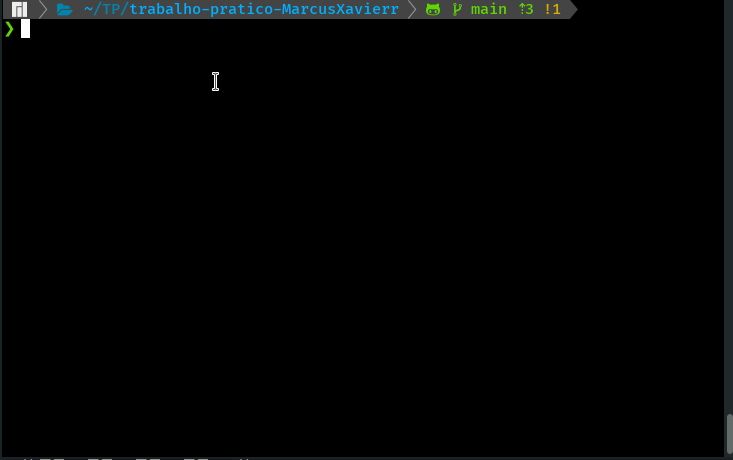

# Checker game made entirely with C

This game was made for an evaluation exercise in my first period of college.

The objective of the project was that the student could implement a checkers game from scratch for the command terminal, and that it would be possible to add an artifical intelligence so that the computer could play alone, or play against a human player.

One of the biggest challenges of the project was making the computer play alone, as its moves couldn't be fully hardcoded as this would make the game very repetitive for the human player and even predictable.

### P.s.: The game currently is on Portuguese, fell free to translate it to any language you want
## TODO
- [ ] Translate the game for English
- [ ] Create a makefile compatible with windows

## Installation
To play this game is super easy, just clone this repo and run make on root of project
```
git clone git@github.com:MarcusXavierr/Checkers.git
cd Checkers
make
```

## Usage
After running ```make``` on terminal you will see the messages of compilation and the game will run.
**You can choose play alone with computer or play with other friend. You can use the commands "salvar" to save the state of the current game into a backup file. To quit the game just type "sair" on terminal anywhere**


**And you can continue the game from where you saved**


**And you can also use the feature that I find the most fun, which is to name player 1 as "bot1" and watch the computer play against itself.**



**And as you can see, the plays are not always the same, which makes the game even more exciting.**


